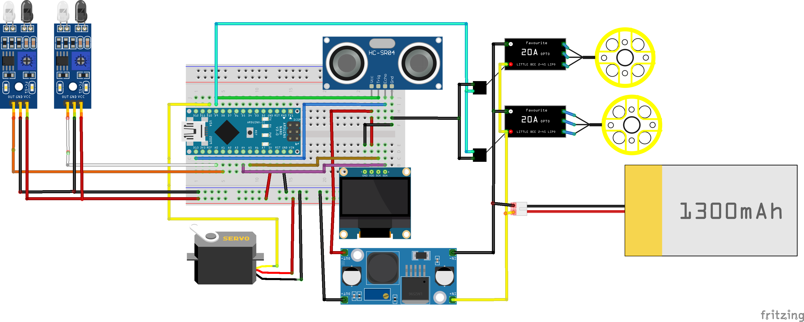

## Projekt-C-Concept_of_an_autonomous_vehicle

## Team members
- Tomáš Bukva (HC04_Sensor_library, text editing)
- Jakub Plachtička (Car_library, Main code)
- Denis Knap (HC04_Sensor_library, text editing)
- Marek Karlíček (Car_library, Main code)
  
## Hardware description
 
 ### doplnit.... line detect, serva, motory ???

### IR sensor FC-51
Is a infrared receiver and transmiter unit with tunable detection range. We use two of these sensors in our car concept installed under the front bumper. Both of them are used for surface change detection to keep the car following the line on the ground (in our case, the line has been made from a black electric tape).

**Features:**
1. Operating Voltage: 3,3 - 5 V DC
2. Current consumption (5 V): 43 mA
3. Detection range: 2 - 30 cm
4. Angle of detection: 35°

**Working principle**
poprosím někoho bystřejšího v kódu o doplňění

 **Pinout Description:**
 1. VCC: 5 V power supply
 2. GND: ground pin
 3. OUT: pin A1 for the left unit, pin A0 for the right unit
 
 ---
 ### HC-SR04
 Is a popular ultrasonic distance sensor for measuring distances. It operates by emitting ultrasonic waves and measuring the time it takes for the sound waves to bounce back after hitting an obstacle.
 
 **Features:**
1.  Operating Voltage: 5 V DC.
2.  Measuring Range: 2 cm to 400 cm.
3.  Accuracy: ±3 mm.
4.  Signal Pins:
    - Trig Pin: Trigger input to send the ultrasonic signal.
    -  Echo Pin: Output signal for measuring the duration of the reflected pulse.
5.  Ultrasound Frequency: 40 kHz.

**Working Principle:**
1.  The sensor emits a short ultrasonic burst when a signal is sent to the  **Triger Pin**.
2.  This burst travels through the air and reflects off an object.
3.  The  **Echo Pin**  generates a signal based on the time it takes for the sound to return.
4.  Using the formula: Distance=Time×Speed of Sound/2. The speed of sound in air is approx. 343 m/s.

 **Pinout Description:**
1.  VCC:  Connects to a 5V power supply.
2.  GND:  Ground pin.
3.  Trig:  Trigger pin for sending pulses.
4.  Echo:  Echo pin for receiving the reflected pulse.
---

## Software description

### Doplnit car library
---
### HC-SR04
The  **HC-SR04 library**  uses two pins for operation: one for the  **Trigger**  (output) and one for the  **Echo**  (input). Additionally, it relies on  **Timer0**  of the microcontroller for time measurement.

1.  **Operation Process:**
    
    -   The microcontroller sends a trigger pulse to the sensor via the trigger pin. This initiates an ultrasonic burst.
    -   Afterward, the microcontroller monitors the echo pin, waiting for the response signal.
    -   Once the echo pin goes HIGH, the timer starts counting. The signal's HIGH duration is proportional to the distance of the detected object.
    -   The microcontroller calculates the distance in millimeters based on the measured time.
2.  **Limitations:**
    
    -   Due to the limited resolution of  **Timer0**  (8 bits), the measurement precision is approximately  **±4 mm**.
    -   The maximum measurable distance is around  **600 mm**  because of the timer's overflow at 8 bits.

## Instructions and photos

přidat fotky

**FC-51**
)

**HC_SR04 Sensor:**

## References and tools
**Visual studio code - PlatformIO**

nevim externí knihovny a tak asi...
